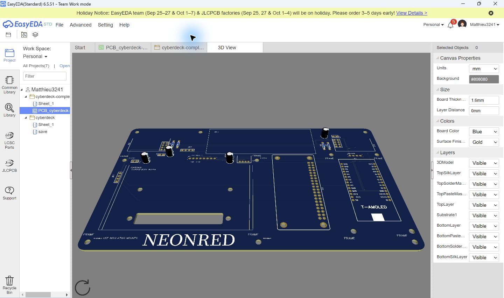
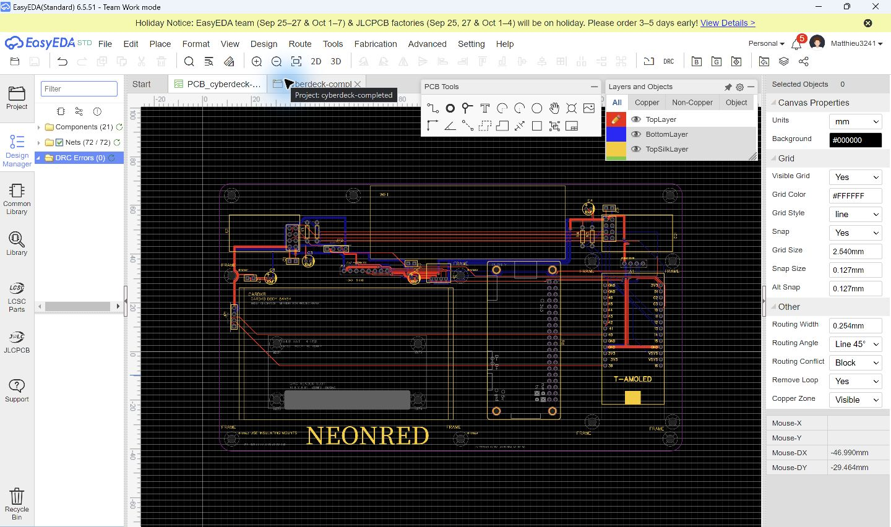
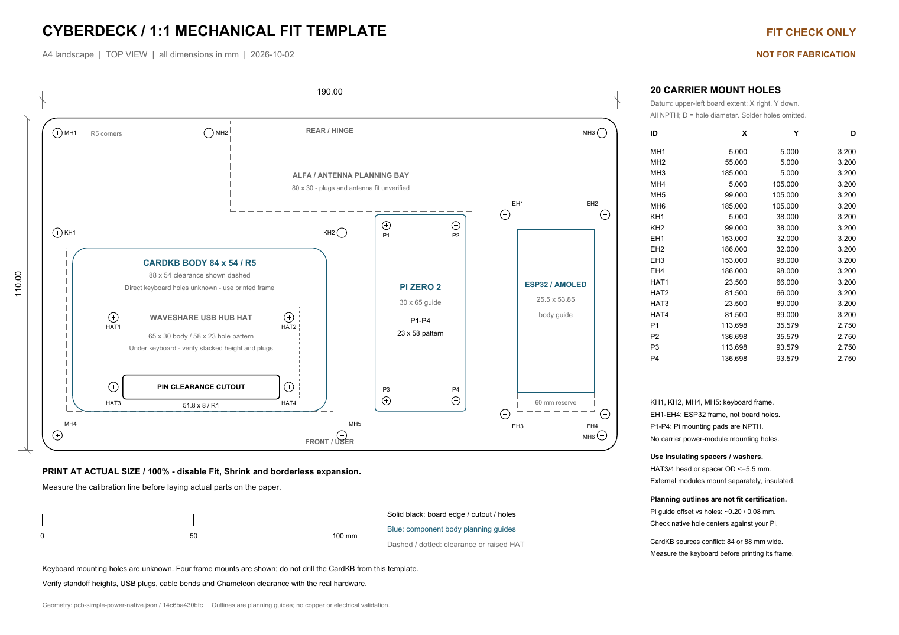

# NEONRED

## What I am building

NEONRED is planned as a clamshell style foldable cyberdeck with different modules that combines a Raspberry Pi Zero 2 W with a LILYGO ESP32-S3 AMOLED controller. The Pi is the main Linux computer and controls the HDMI display. The ESP32 controls the small AMOLED screen, CardKB keyboard, rotary encoder, IR hardware, and radio modules.

## Why I am making it

I am making it after my start of the year in a class called AP Cybersecurity, it's the first year they have offered a class like this, and I am very intersted, my teacher suggested we make cybersecurity related projects.

## Planned capabilities
- Linux computer based on a Raspberry Pi Zero 2 W
- HDMI display in the lid
- Secondary LILYGO ESP32-S3 AMOLED interface
- CardKB I2C keyboard and rotary-encoder input
- IR transmit/receive module on the side of the case
- Two nRF24L01+ radio modules
- NFC/RFID development with Chameleon Ultra SE3
- USB hub mounted beside the Pi beneath the keyboard
- Battery space, service access, and folding antenna mounts

  It will be used to analyze wifi and bluetooth signals, NFC and RFID, IR, and be used as a linux machine. I will use it in class to try and practice hack the box challenges that our teacher is organizing.

## PCB and wiring

The current carrier board is 190 × 110 mm. It has module footprints, locations fo parts and their outline.

- [Saved schematic source](PCB/schematic-simple-power-native.json)
- [Saved PCB source](PCB/pcb-simple-power-native.json)
- [Wiring map](PCB/wiring-map-simple-power.txt)
- [1:1 mounting template](PCB/simple-power-mounting-template.pdf)

### Power plan

The Pi, ESP32/LILYGO board, HDMI display, and Chameleon use their own intact USB power connections. The carrier board is not a high-current USB power distributor. CardKB uses 5 V, while the radios and IR hardware use the separate 3.3 V peripheral regulator. All grounds are common.

## Firmware

The repository includes starter firmware and a documented serial protocol. It has not been run against the final hardware yet.

- [`Firmware/esp32/`](Firmware/esp32/) — ESP32 firmware scaffold
- [`Firmware/pi/`](Firmware/pi/) — Pi bridge and BLE discovery scaffold
- [`Firmware/PROTOCOL.md`](Firmware/PROTOCOL.md) — serial-message format

## Bill of materials

https://docs.google.com/spreadsheets/d/15TbgYwyxuw6ulc80f8xgyEBDQYSM2Vez6B2vkB-bnEY/edit?gid=0#gid=0

## Build plan

1. Get all the parts first and mount them on the PCB
2. Test that every part works
3. Refine the CAD case
4. Assemble everything together
5. Code it
6. Test it
7. Send a final summary and demonstrations to forge.
